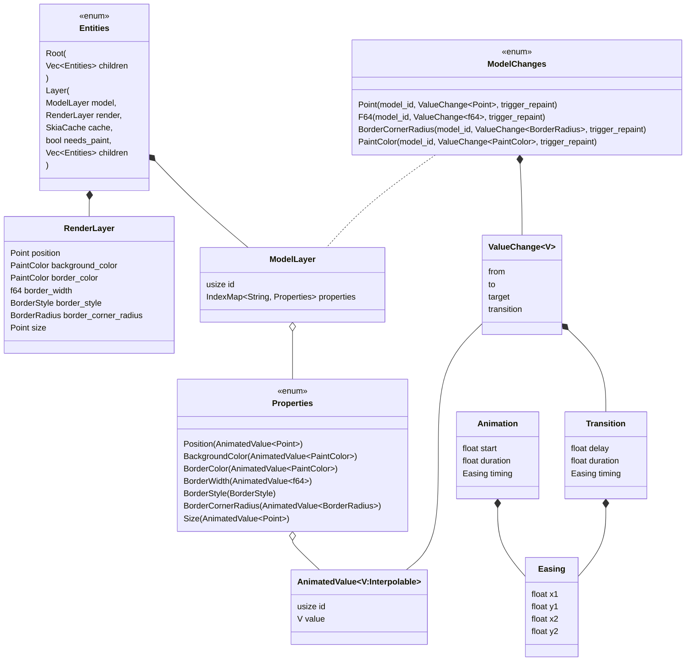

```mermaid
classDiagram
   
  class RenderLayer{
    Point position
    PaintColor background_color
    PaintColor border_color
    f64 border_width
    BorderStyle border_style
    BorderRadius border_corner_radius
    Point size
    
  }
  
  class AnimatedValue~V:Interpolable~ {
    usize id
    V value
  }

  class Easing {
    float x1
    float y1
    float x2
    float y2
  }
  class Animation {
    float start
    float duration
    Easing timing
  }

  class Transition {
    float delay
    float duration
    Easing timing
  }

  class ModelLayer {
    usize id
    IndexMap~String, Properties~ properties
  }

  class Properties {
    <<enum>>
    Position(AnimatedValue~Point~)
    BackgroundColor(AnimatedValue~PaintColor~)
    BorderColor(AnimatedValue~PaintColor~)
    BorderWidth(AnimatedValue~f64~)
    BorderStyle(BorderStyle)
    BorderCornerRadius(AnimatedValue~BorderRadius~)
    Size(AnimatedValue~Point~)
  }

  class ValueChange~V~ {
    from
    to
    target
    transition
  }

  class ModelChanges {
    <<enum>>
    Point(model_id, ValueChange~Point~, trigger_repaint)
    F64(model_id, ValueChange~f64~, trigger_repaint)
    BorderCornerRadius(model_id, ValueChange~BorderRadius~, trigger_repaint)
    PaintColor(model_id, ValueChange~PaintColor~, trigger_repaint)
  }

  class Entities {
    <<enum>>
    Root(
      Vec~Entities~ children
    )
    Layer(
      ModelLayer model,
      RenderLayer render,
      SkiaCache cache,
      bool needs_paint,
      Vec~Entities~ children
    )
  }

  Entities *-- RenderLayer
  Entities *-- ModelLayer

  Animation *-- Easing
  Transition *-- Easing

  ModelChanges .. ModelLayer

  ModelLayer o-- Properties
  Properties o-- AnimatedValue

  ValueChange -- AnimatedValue
  ValueChange *-- Transition

  ModelChanges *-- ValueChange
```